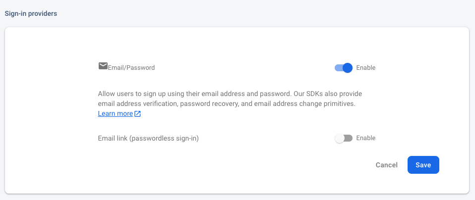

# Firebase UI Email auth provider

## Configuration

To support email a provider, first ensure that the "Email/Password" provider is
enabled in the [Firebase Console](https://console.firebase.google.com/project/_/authentication/providers):



Configure email provider:

```dart
import 'package:firebase_core/firebase_core.dart';
import 'package:firebase_ui_auth/firebase_ui_auth.dart';

// If you need to use FirebaseAuth directly, make sure to hide EmailAuthProvider:
// import 'package:firebase_auth/firebase_auth.dart' hide EmailAuthProvider;

import 'firebase_options.dart';

void main() {
  WidgetsFlutterBinding.ensureInitialized();
  await Firebase.initializeApp(options: DefaultFirebaseOptions.currentPlatform);

  FirebaseUIAuth.configureProviders([
    EmailAuthProvider(),
    // ... other providers
  ]);
}
```

## Using screen

After adding `EmailAuthProvider` to the `FirebaseUIAuth.configureProviders` email form would be displayed on the `SignInScreen` or `RegisterScren`.

```dart
SignInScreen(
  actions: [
    AuthStateChangeAction<SignedIn>((context, state) {
      if (!state.user!.emailVerified) {
        Navigator.pushNamed(context, '/verify-email');
      } else {
        Navigator.pushReplacementNamed(context, '/profile');
      }
    }),
  ],
);
```

> Notes:
>
> - see [navigation guide](../navigation.md) to learn how navigation works with Firebase UI.
> - explore [FirebaseUIActions API docs](https://pub.dev/documentation/firebase_ui_auth/latest/firebase_ui_auth/FirebaseUIAction-class.html).

## Using view

If the pre-built screens don't suit the app's needs, you could use a `LoginView` to build your custom screen:

```dart
class MyLoginScreen extends StatelessWidget {
  @override
  Widget build(BuildContext) {
    return Scaffold(
      body: Row(
        children: [
          MyCustomSideBar(),
          Padding(
            padding: const EdgeInsets.all(16),
            child: FirebaseUIActions(
              actions: [
                AuthStateChangeAction<SignedIn>((context, state) {
                  if (!state.user!.emailVerified) {
                    Navigator.pushNamed(context, '/verify-email');
                  } else {
                    Navigator.pushReplacementNamed(context, '/profile');
                  }
                }),
              ],
              child: LoginView(
                action: AuthAction.signUp,
                providers: FirebaseUIAuth.providersFor(
                  FirebaseAuth.instance.app,
                ),
              ),
            ),
          )
        ],
      ),
    );
  }
}
```

## Using widget

If a view is also not flexible enough, there is an `EmailForm`:

```dart
class MyCustomWidget extends StatelessWidget {
  @override
  Widget build(BuildContext context) {
    return AuthStateListener<EmailAuthController>(
      listener: (oldState, newState, controller) {
        // perform necessary actions based on previous
        // and current auth state.
      },
      child: EmailForm(),
    )
  }
}
```

## Building a custom widget with `AuthFlowBuilder`

You could also use `AuthFlowBuilder` to facilitate the functionality of the `EmailAuthFlow`:

```dart
class MyCustomWidget extends StatelessWidget {
  @override
  Widget build(BuildContext context) {
    return AuthFlowBuilder<EmailAuthController>(
      builder: (context, state, ctrl, child) {
        if (state is AwaitingEmailAndPassword) {
          return MyCustomEmailForm();
        } else if (state is SigningIn) {
          return CircularProgressIndicator();
        } else if (state is AuthFailed) {
          return ErrorText(exception: state.exception);
        } else {
          return Text('Unknown state $state');
        }
      },
    );
  }
}
```

## Building a custom stateful widget

For full control over every phase of the authentication lifecycle, you could build a stateful widget which implements `EmailAuthListener`:

```dart
class CustomEmailSignIn extends StatefulWidget {
  const CustomEmailSignIn({Key? key}) : super(key: key);

  @override
  State<CustomEmailSignIn> createState() => _CustomEmailSignInState();
}

class _CustomEmailSignInState extends State<CustomEmailSignIn>
    implements EmailAuthListener {
  final auth = FirebaseAuth.instance;
  late final EmailAuthProvider provider = EmailAuthProvider()
    ..authListener = this;

  Widget child = MyCustomEmailForm(onSubmit: (email, password) {
    provider.authenticate(email, password, AuthAction.signIn);
  });

  @override
  Widget build(BuildContext context) {
    return Center(child: child);
  }

  @override
  void onBeforeCredentialLinked(AuthCredential credential) {
    setState(() {
      child = CircularProgressIndicator();
    });
  }

  @override
  void onBeforeProvidersForEmailFetch() {
    setState(() {
      child = CircularProgressIndicator();
    });
  }

  @override
  void onBeforeSignIn() {
    setState(() {
      child = CircularProgressIndicator();
    });
  }

  @override
  void onCanceled() {
    setState(() {
      child = MyCustomEmailForm(onSubmit: (email, password) {
        auth.signInWithEmailAndPassword(email: email, password: password);
      });
    });
  }

  @override
  void onCredentialLinked(AuthCredential credential) {
    Navigator.of(context).pushReplacementNamed('/profile');
  }

  @override
  void onDifferentProvidersFound(
      String email, List<String> providers, AuthCredential? credential) {
    showDifferentMethodSignInDialog(
      context: context,
      availableProviders: providers,
      providers: FirebaseUIAuth.providersFor(FirebaseAuth.instance.app),
    );
  }

  @override
  void onError(Object error) {
    try {
      // tries default recovery strategy
      defaultOnAuthError(provider, error);
    } catch (err) {
      setState(() {
        defaultOnAuthError(provider, error);
      });
    }
  }

  @override
  void onSignedIn(UserCredential credential) {
    Navigator.of(context).pushReplacementNamed('/profile');
  }
}
```

## Other topics

- [Email verification](./email-verification.md)
- [EmailLinkAuthProvider](./email-link.md) - allows registering and signing using a link sent to email.
- [PhoneAuthProvider](./phone.md) - allows registering and signing using a phone number
- [UniversalEmailSignInProvider](./universal-email-sign-in.md) - gets all connected auth providers for a given email.
- [OAuth](./oauth.md)
- [Localization](../../../firebase_ui_localizations/README.md)
- [Theming](../theming.md)
- [Navigation](../navigation.md)
